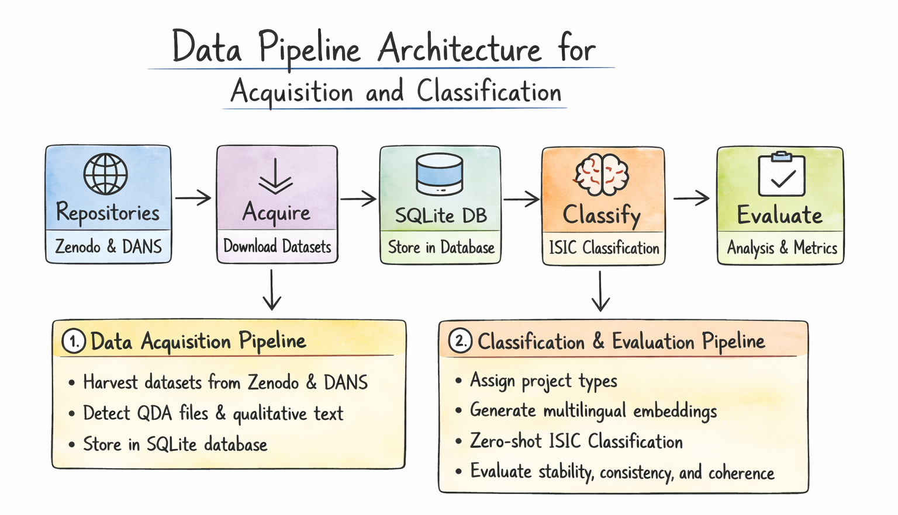

# 📘 **SeedingQDArchive: Automated Pipeline for Harvesting and Classifying Qualitative Research Datasets**

## 🌍 **1. Introduction**

QDArchive is an end-to-end pipeline designed to identify, retrieve, classify, and semantically organize **qualitative research datasets** from major open repositories.



The pipeline operates in two distinct phases:

1. **Acquisition:** Automatically harvests and filters datasets from **Zenodo** and **DANS Data Stations (Dataverse)**, identifying qualitative project files (NVivo, ATLAS.ti, MaxQDA, REFI-QDA) and textual materials (interviews, transcripts, field notes) across multiple languages.
2. **Classification:** Semantically indexes and maps the acquired data to the **ISIC Rev.5 (International Standard Industrial Classification) taxonomy** using dense vector embeddings, providing automated thematic organization by economic sector.

The pipeline maintains a structured **SQLite data model**, facilitating reproducible research, metadata standardization, and downstream discovery.

---

## 🧠 **2. Data Acquisition Logic**

Every discovered dataset is filtered through a strict, automated evaluation process to ensure only relevant qualitative materials are archived:

* **QDA Container Detection:** Instantly downloads the entire dataset if native qualitative software files (such as NVivo, ATLAS.ti, or MaxQDA formats) are detected.
* **Irrelevance Filtering:** Automatically bypasses and excludes datasets that contain purely quantitative, spatial, or non-qualitative formats.
* **Qualitative Indicator Scan:** Scans metadata for explicit qualitative indicators (such as references to transcripts, interviews, or field notes) to trigger downloads of supporting text files.
* **Default Exclusion:** Rejects and skips any dataset that fails to meet either the software container or qualitative indicator criteria.

---

## 🏷️ **3. Data Classification Logic**

Once datasets are saved, the system automatically indexes and semantically categorizes them:

* **Operational Categorization:** Groups datasets into functional categories based on their contents—either as dedicated software projects, raw qualitative text collections, or unrelated non-qualitative data.
* **Taxonomic Reference Mapping:** Converts the official descriptions of the ISIC Rev.5 economic sectors into dense mathematical reference vectors.
* **Semantic Similarity Matching:** Merges dataset metadata and extracted file text into a unified narrative, matching it against the reference vectors to assign primary and secondary economic classifications.
* **Hierarchical Propagation:** Applies the resulting classification scores from the top project level down to individual files to map sub-topics within complex datasets.

## 🖥️ **4. Running the Pipeline**

### **Part 1: Harvesting & Database Seeding**

Navigate to the acquisition directory and run the orchestrator:

```bash
cd data_acquisition

# Run Zenodo collection
python pipeline.py --zenodo

# Run DANS collection
python pipeline.py --dans

# Run all platforms sequentially
python pipeline.py --all

```

### **Part 2: Semantic Classification & Diagnostics**

Navigate to the classification directory to execute the pipeline stages:

```bash
cd ../data_classification

# Step A: Perform project type categorization
python project_type.py

# Step B: Run semantic ISIC mapping
python run_classification.py

# Step C: Generate quality and diagnostic metrics
python evaluate.py

```

---

## 📊 **5. Evaluation Quality Metrics**

The classification pipeline monitors output quality using three main metrics:

* **Stability Score:** Measures how classification changes when adjusting chunk limits and preview lengths during context generation.
* **Coherence Score:** Calculates semantic similarity between the project-level assignment and independent classifications calculated for its constituent files.
* **Classification Consistency:** Evaluates taxonomic alignment across multi-language equivalents of the same project context.

---

## 🗃️ **6. Data Sources & Citation**

QDArchive harvests publicly available research datasets from open-science infrastructures:

### 🧩 **Zenodo (CERN, OpenAIRE)**

Datasets are retrieved via the **Zenodo REST API** ([https://zenodo.org/api/records](https://zenodo.org/api/records)).

**Citation:**

> Zenodo (CERN). *Zenodo Research Data Repository*. Available at: [https://zenodo.org](https://zenodo.org)

### 🧩 **DANS Data Stations (KNAW, Dutch Research Council)**

Datasets are retrieved via the domain-specific **Dataverse API** installations ([https://dans.knaw.nl](https://dans.knaw.nl)).

**Citation:**

> DANS. *DANS Data Stations (Dataverse)*. Available at: [https://dans.knaw.nl](https://dans.knaw.nl)

### 🧾 **Dataset-Level Citations**

Every dataset harvested by QDArchive includes its own DOI and license information stored in the database. Users must cite **each dataset individually**, following the repository’s citation format. The pipeline preserves:

* DOI (concept or version)
* Authors, creators, and uploaders
* License identifiers and keywords

---

## ⚖️ **7. Ethical & Legal Considerations**

* **Public Access Only:** The pipeline exclusively targets publicly accessible records. Restricted-access datasets requiring specific authorization are skipped automatically.
* **License Maintenance:** Original licenses (CC-BY, CC0, and other open-source arrangements) are captured alongside file payloads to ensure downstream compliance.
* **Respectful Crawling:** Acquisition routines incorporate polite rate-limiting, honoring the hosting servers' capacity limits.

---

## 🙏 **Acknowledgments**

I would like to express my sincere gratitude to **Prof. Dr. Dirk Riehle, M.B.A.** for providing me with the opportunity to work on this project and for his continuous guidance throughout its development. His insights, feedback, and support were invaluable in shaping the direction and quality of this work.
